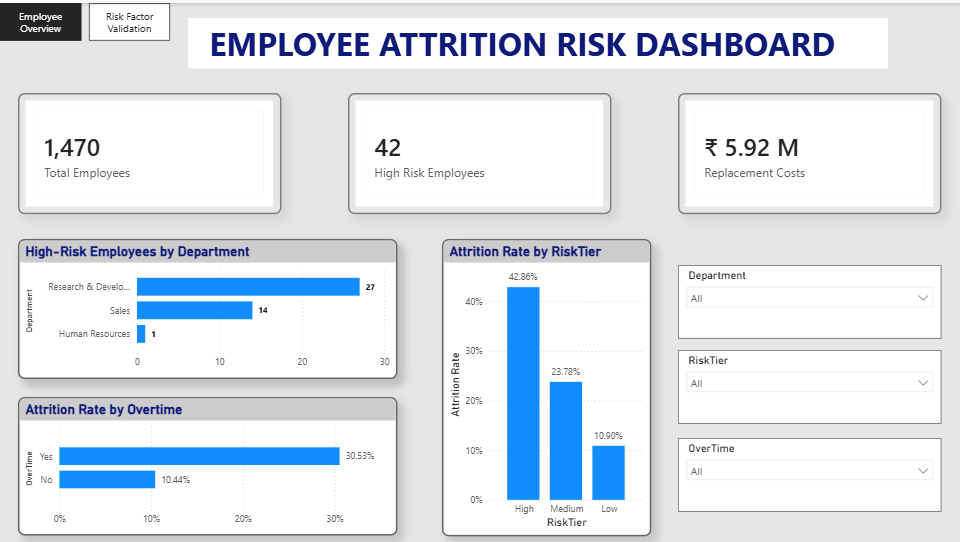
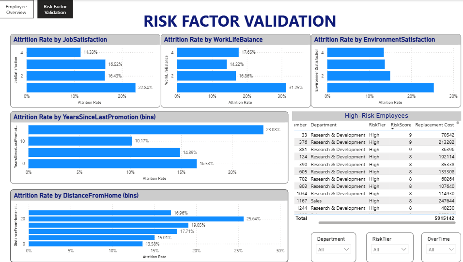

# Employee Attrition Risk Dashboard

## Project Overview

Employee attrition is one of the major challenges faced by organizations. This project analyzes employee attrition patterns and identifies high-risk employees using a custom risk scoring model. The dashboard helps HR teams understand key factors influencing employee attrition and estimate replacement costs.

---

## Dashboard Preview

### Employee Overview

### Risk Factor Validation

---

## Objectives

- Analyze employee attrition trends.
- Identify High, Medium and Low Risk employees.
- Estimate employee replacement cost.
- Understand major attrition drivers.
- Build an interactive HR dashboard.

---

## Tools Used

- Power BI
- SQL
- Python (Pandas & NumPy)
- Microsoft Excel

---

## Dataset

IBM HR Analytics Employee Attrition Dataset

---

## Dashboard Features

### Employee Overview

- Total Employees
- High Risk Employees
- Replacement Cost
- High-Risk Employees by Department
- Attrition Rate by Risk Tier
- Attrition Rate by Overtime
- Interactive slicers

### Risk Factor Validation

- Attrition by Job Satisfaction
- Attrition by Work-Life Balance
- Attrition by Environment Satisfaction
- Attrition by Distance From Home
- Attrition by Years Since Last Promotion
- High-Risk Employee Table

---

## Key Insights

- Research & Development has the highest number of high-risk employees.
- Employees working overtime have a significantly higher attrition rate.
- Low Job Satisfaction and poor Work-Life Balance are strongly associated with employee attrition.
- Estimated replacement cost for high-risk employees exceeds ₹5.9 million.
  
---

## Author

**Atchaya ADR**

Aspiring Data Analyst

Skills: SQL | Python | Power BI | Excel
